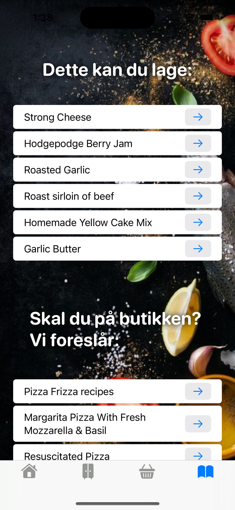

# Start code 
## FoodManager
Vi bruker python som backend og SwiftUI som frontend.

### Team
- Backend ansvalrig: Herman
- API ansvarlig: Vebjørn
- Frontend ansvarlig: Kristian
- Design ansvarlig: Julia
